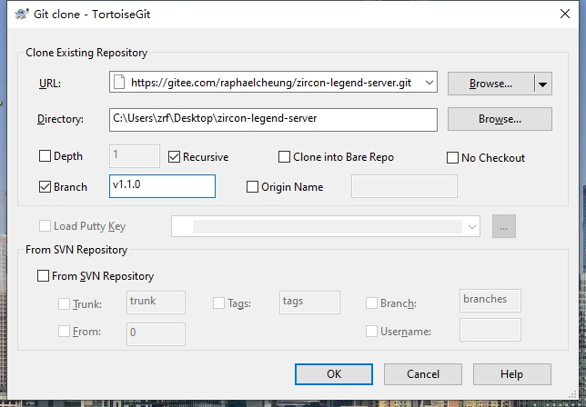

# 皓石传奇三- 服务器 Zircon Mir3 Server

本开源项目仅供学习游戏技术，禁止商用以及非法用途。

**本项目主站为 [Gitee-��石传奇三](https://gitee.com/raphaelcheung/zircon-legend-server.git)，其他平台均为镜像。
版本发布只放在主站上！**

本项目从吉米 2019 年流传出来的 Zircon 版本发展而来，修复了上百个Bug。
为降低部署成本，将服务器做成了跨平台可docker的版本，
由于原版服务器依赖商业组件 **DevExpress** 并且不支持跨平台，
因此连同界面一同剥离出去，仅数据库保持与原版工具兼容可编辑。
（LOMCN上 2025 年发布的新版工具由于重构了数据库，无法兼容，只能和老版本工具兼容）

觉得本项目对你有帮助的别忘了 **点个星** ，祝你年年发大财！

技术交流以及体验公益服请加 【[QQ群：915941142](https://qm.qq.com/q/JeoJOJ4z4e)】


## 游戏简介

### 完整的传奇三游戏

- 含了四个职业：战士、法师、道士、刺客<br/>
<br/>
<br/>
<br/>
	
- 技能丰富，平均每个职业有 38 个技能<br/>
<br/>


- 地图和道具及其丰富，玩到 100级没压力；

- 技能正常修炼到 3级以后，还可通过打出高等级技能书一直升到 6级；

- 武器和首饰均可精炼，品质高的装备精炼上限也更高；

- 法师招宠与道士的宠物最高可升至暗金等级，各项属性翻倍，非常实用；

- 刺杀剑术破防之余，技能等级越高，刺杀剑术的攻速越快，爽之又爽；

### 支持多平台部署

服务端支持在 Linux、Windows、Docker 平台上部署。


<br/>
	
### 便捷传送

每个传送石都可以方便地传送到任意地图。<br/>

<br/>

## 服务器部署

### 下载运营数据

包含了地图数据比较大，压缩之后仍然有近 800Mb，因此只能放在网盘中。

【[百度网盘](https://pan.baidu.com/s/1OMkb834cOtxF8KIrlJMKRQ?pwd=h1bv)】

如果嫌百度网盘太慢，这份运营数据我也保存到了 QQ 群文件中，【[QQ群：915941142](https://qm.qq.com/q/JeoJOJ4z4e)】

内置账号： **zrf@zrf.zrf、raphael@gm.gm** ，密码均为  **123456** ， 可直接登录游玩。

其中  **raphael@gm.gm**  为管理员账号，包含了三个管理员角色 **raphael01、raphael02、raphael03** 管理员密码为  **123456** 。

去版本 [发布页面](https://gitee.com/raphaelcheung/zircon-legend-server/releases) 下载最新的服务器配置文件` Server.ini `，根据需要修改服务器 IP 以及端口。

### 部署游戏服务

- #### 推荐用 docker-composer 部署。

镜像名称：` raphzhang/zirconlegend:latest `，每次发布都会更新到 docker。

注意要将上一步下载来的运营数据解压后映射到容器的` /zircon/datas `目录。

配置文件` Server.ini `同样映射到容器的目录` /zircon/datas `下。

```
services:
	zircon:
		container_name: zircon
		image: raphzhang/zirconlegend:latest
		networks:
			1panel-network:
				ipv4_address: 172.18.0.82
		ports:
			- 192.168.0.3:17000:7000
		restart: unless-stopped
		user: "0:0"
		volumes:
      - ./datas:/zircon/datas
      - /etc/localtime:/etc/localtime:ro
      - /etc/timezone:/etc/timezone:ro
version: "3"
networks:
	1panel-network:
		external: true
```

成功运行后能看到类似下面的输出就表示运行成功：

```
皓石传奇三 v1.9.0.25852
免费开源的传奇三，技术交流或想体验公益服进QQ群 915941142
客户端更新路径：
地图文件路径：./datas/Map/
最大连接数量限制：200
[2025-01-28 14:37:52]: 网络已启动.
[2025-01-28 14:37:52]: Web 服务已启动.
[2025-01-28 14:37:52]: 转生玩家死亡优化：True
[2025-01-28 14:37:52]: 幽灵船通向地图：神舰入口
[2025-01-28 14:37:52]: 地狱之门通向地图：赤龙城入口
[2025-01-28 14:37:52]: 加载耗时: 3 秒
```

- #### Windows 10 部署

新建一个英文名服务器根目录，从 [发布页面](https://gitee.com/raphaelcheung/zircon-legend-server/releases) 下载运行包解压到根目录下。

根目录下建立一个子目录` datas `。

把前面下载的运营数据解压连同配置文件` Server.ini `放入子目录` datas `中。

用管理员权限运行根目录的` Server.exe `。

### 配置自动更新

- 要实现客户端的自动更新，要求 [启动器](https://gitee.com/raphaelcheung/zircon-legend-launcher)、客户端、服务器的版本均在 **v1.0.0** 以上。

- 首先保证服务器是停止运行的状态。

- 以服务器 Windows10 为例，在` datas `目录下创建一个` Client `目录，将需要更新的客户端文件都放入其中。

- 修改配置` Server.ini `：

```
[System]
ClientPath=./datas/Client
```

- 启动服务器后，会先扫描生成更新清单，这样服务器就准备好了。

- 如果需要更新启动器` Launcher.exe `，同样放入` Client `目录即可更新。

### 反向代理

如果你设置了` Nginx `反向代理游戏流量从而导致游戏服务器获取不到真实客户端 IP。

你需要在` Nginx `上开启` proxy_protocol `，同时打开服务器的配置项：
```
[Network]
UseProxy=True
```

这样服务器就能获取到转发流量的真实 IP 地址。

### GM 管理

登录的时候，账号那里填写管理员账号，密码要使用管理员密码进行登录，才会具备 GM 权限。

以下是 GM 管理员命令，方括号的是选填参数：

```
@TAKECASTLE [城堡指数]
@FORCEENDWAR [城堡指数] 参数1       #结束攻城
@FORCEWAR [城堡指数]    参数1            #开始攻城
@CLEARBELT
@MAP [地图名]
@GLOBALBAN [角色名] [*持续时间]
@CHATBAN [角色名] [*持续时间]             #禁止聊天
@REFUNDHUNTGOLD [角色] [数量]        #狩猎金币
@REFUNDGAMEGOLD  [角色] [数量]       #奖励游戏币
@TAKEGAMEGOLD  [角色] [数量]            #移除游戏币
@REMOVEGAMEGOLD [角色] [数量]       #因为支付失败扣除游戏币
@GIVEGAMEGOLD  [角色] [数量]              #成功购买 游戏币
@REBOOT   重启
@GCCOLLECT   gc收集
@MAKE 物品名称 [数量]
@SETCOMPANIONVALUE [Level] [Stat] [Value]
@GIVESKILLS [角色名]         #给与全部技能
@GOTO 角色名
@LEVEL [角色名]   等级        #调整指定角色等级，如果角色名为空，则调整当前角色
@ITEMBOT [角色名]
@GOLDBOT [角色名]
@GAMEMASTER    
@OBSERVER                         #切换隐身模式
@RECALL 角色名                  #召唤到身边
@LEAVEGUILD
@ALLOWGUILD
@BLOCKWHISPER
@ALLOWTRADE
@ENABLELEVEL3
@ENABLELEVEL5
@ENABLELEVEL7
@ENABLELEVEL10
@ENABLELEVEL11
@ENABLELEVEL13
@ENABLELEVEL15
@EXTRACTORLOCK
@ROLL [Amount]
@PLAYERONLINE                  #查看在线人数，在线设备数
@CHARACTERONLINE         #列举 20 个在线的角色名称
@ADMIN 账号 true/false      #在线设置账号的管理员权限（临时管理员），这里设置的权限也会永久保存
@修改密码 账号 新密码        #修改指定账号的密码
@禁止登录 账号 封禁秒数    #在指定时间内禁止账号登录，秒数为0表示解禁
@恢复误删 角色名                #恢复误删角色
@重载更新                            #重新加载客户端更新目录下的文件
@屏蔽物品掉落 物品名 true/false   #设置为true后，该物品不会从任何怪物身上掉落
@保存数据库                        #将内存中的数据库保存到文件，比如屏蔽物品掉落的改动、地图怪物倍率的改动等
@监控在线                            #打开后，任何角色上下线都会收到消息
@在线角色                            #列出所有在线的角色
@怪物倍率                            #显示当前地图怪物的倍率数据
@怪物倍率 生命倍率 最大生命倍率 伤害倍率 最大伤害倍率 经验倍率 最大经验倍率 掉落倍率 最大掉落倍率 金币倍率 最大金币倍率   #修改当前地图的怪物倍率数据
@清理怪物                            #清除当前地图上所有的怪物，过一会地图会自动刷新新的怪物
@开启怪物攻城                     #会全服发出当前GM所在地图的攻城通知，当前地图的卫士会全部隐藏
@结束怪物攻城                     #全服发出怪物攻城结束的通知，当前地图的卫士正常出现
@内存统计                             #将当前的用户数据统计出来并写入到文件中以便分析
@角色关联 [角色名]              #如果没写角色名，会将所有在线角色根据设备号分类输出；如果写了角色名则只列出该角色相同设备的角色
@找怪物 怪物名                    #寻找一只不在可视范围内的怪物，并传送到怪物旁边
@怪物数值 [mr=?,?] [ac=?,?] [hp=?] [gc=?,?]  #设置怪物的属性，一次可以设多个属性，可以只设置一个属性，设置后只影响新刷出来的怪物
```

## 客户端

获取客户端去这里看 【[ZirconLegend-Client](https://gitee.com/raphaelcheung/zircon-legend-client)】

## 服务器 代码编译

开发环境依赖：

- Microsoft Visual Studio Community 2022

- .Net 8.0

安装这些后拉取全库代码。

项目包含了子模块，拉取的时候要选中` Recursive `。

这样才能把子模块一并拉取下来。

主干处于持续开发状态，推荐拉取发布版本。<br/>
<br/>

如果还是拉不下子模块，
可以把【[ZirconLegend-Library](https://gitee.com/raphaelcheung/zircon-legend-library)】拉下来，
然后移动到` Library `目录下。

项目的编译依赖都已预设好，直接编译即可