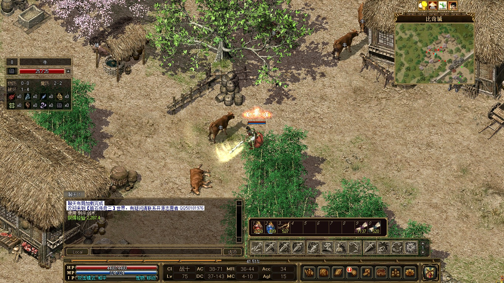
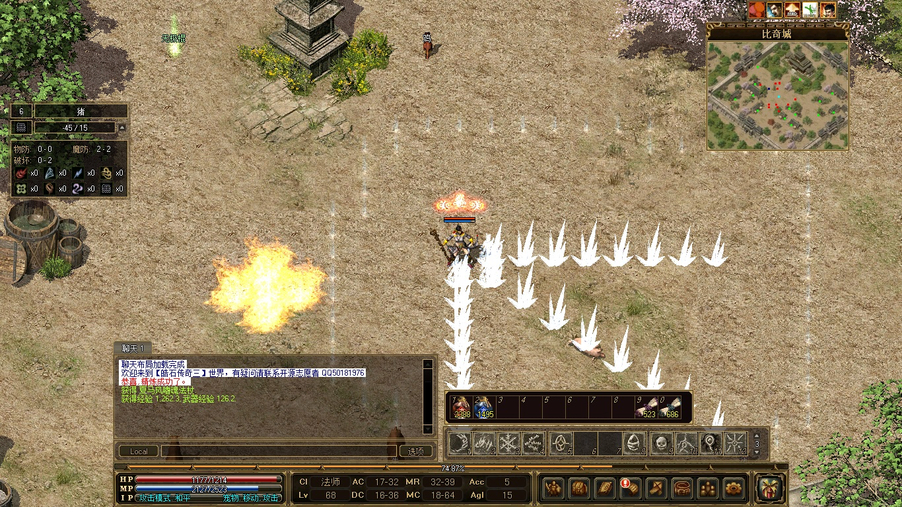
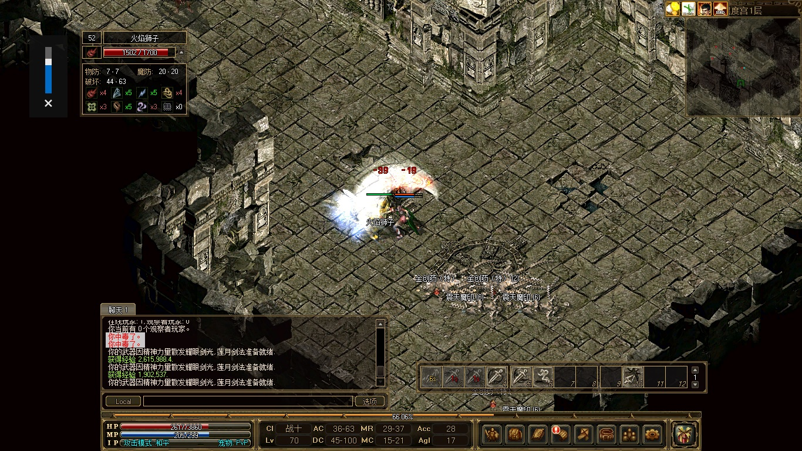
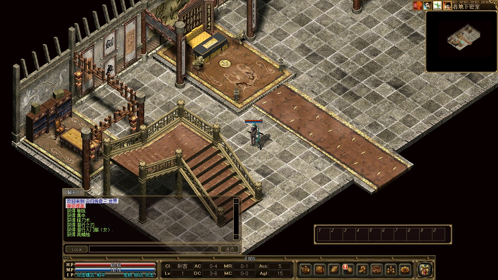
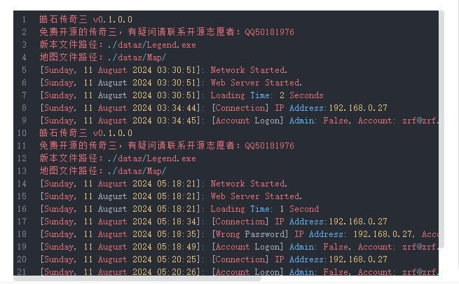
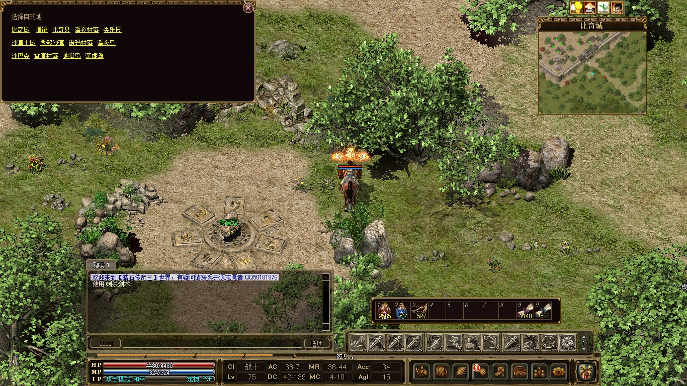

# 皓石传奇三

<br/>
完整的传奇三游戏，包含了四个职业：战士、法师、道士、刺客，共 146 个技能，平均每个职业有 38 个技能。
<br/>
<br/>
<br/>
<br/>
<br/>
<br/>
服务端支持 Linux、Windows、Docker 部署。<br/>

<br/>
每个传送石都可以方便地传送到任意地图。<br/>

<br/>

## 服务器部署

### 下载运营数据

包含了地图数据比较大，压缩之后仍然有近 800MB，因此只能放在网盘中。

[百度网盘分享 提取码：9vqz](链接：https://pan.baidu.com/s/1RflU-PPn5BMoEPL8cOhp1g?pwd=9vqz)

内置账号： **zrf@zrf.zrf、raphael@gm.gm** ，密码均为  **123456** ， 可直接登录游玩。

其中  **raphael@gm.gm**  为管理员账号，包含了三个管理员角色 **raphael01、raphael02、raphael03** 管理员密码为  **654321** 。


### 部署游戏服务

推荐用 docker-composer 部署。

注意要将上一步下载来的运营数据解压后映射到容器的 /zircon/datas 目录。

```
services:
    zircon:
        container_name: zircon
        image: raphzhang/zirconlegend:latest
        networks:
            1panel-network:
                ipv4_address: 172.18.0.82
        ports:
            - 192.168.0.3:17000:7000
        restart: unless-stopped
        user: "0:0"
        volumes:
            - ./datas:/zircon/datas
version: "3"
networks:
    1panel-network:
        external: true
```

 **成功运行后能看到如下输出：** 

```
皓石传奇三 v0.1.0.0
免费开源的传奇三，有疑问请联系开源志愿者：QQ50181976
版本文件路径：./datas/Legend.exe
地图文件路径：./datas/Map/
[Sunday, 11 August 2024 03:30:51]: Network Started.
[Sunday, 11 August 2024 03:30:51]: Web Server Started.
[Sunday, 11 August 2024 03:30:51]: Loading Time: 2 Seconds
```

### GM 管理

登录的时候，账号那里填写游戏角色名字，注意，是填**角色名字**！然后密码使用管理员密码进行登录，才会具备 GM 权限。

以下是 GM 管理员命令：

```
@TAKECASTLE [城堡指数]
@FORCEENDWAR [城堡指数] 参数1  结束攻城
@FORCEWAR [城堡指数]    参数1   开始
@CLEARBELT
@MAP [地图名]
@GLOBALBAN [角色名] [*持续时间]
@CHATBAN [角色名] [*持续时间]    禁止聊天
@REFUNDHUNTGOLD [角色] [数量]   狩猎金币
@REFUNDGAMEGOLD  [角色] [数量]    奖励游戏币
@TAKEGAMEGOLD  [角色] [数量]      移除游戏币
@REMOVEGAMEGOLD [角色] [数量]  因为支付失败扣除游戏币
@GIVEGAMEGOLD  [角色] [数量]   成功购买 游戏币
@REBOOT   重启
@GCCOLLECT   gc收集
@MAKE [物品名称] [数量]
@SETCOMPANIONVALUE [Level] [Stat] [Value]
@GIVESKILLS [角色名]   给与全部技能
@GOTO [角色名]
@LEVEL [角色名|  Level] [*Level]  调整自身等级
@ITEMBOT [角色名]
@GOLDBOT [角色名]
@GAMEMASTER    
@OBSERVER      退出 进入隐身模式
@RECALL [角色名]    召唤到身边
@LEAVEGUILD
@ALLOWGUILD
@BLOCKWHISPER
@ALLOWTRADE
@ENABLELEVEL3
@ENABLELEVEL5
@ENABLELEVEL7
@ENABLELEVEL10
@ENABLELEVEL11
@ENABLELEVEL13
@ENABLELEVEL15
@EXTRACTORLOCK
@ROLL [Amount]
```

## 客户端

获取客户端去这里看 [ZirconLegend-Client](https://gitee.com/raphaelcheung/zircon-legend-client)

## 代码编译

开发环境依赖：

- Microsoft Visual Studio Community 2022

- .Net 8.0

安装这些后拉取全库代码，要注意的是项目包含了子模块，拉取的时候要选中 `Recursive`。

这样才能把子模块一并拉取下来，项目的编译依赖都已预设好，直接编译即可