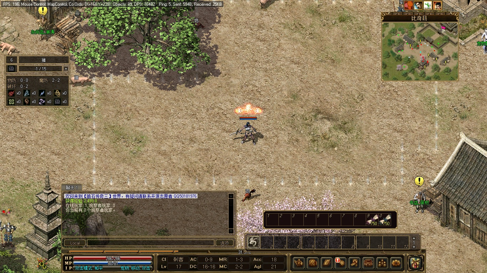

# 皓石传奇三

<br/>
完整的传奇三游戏，包含了四个职业：战士、法师、道士、刺客，共 146 个技能，平均每个职业有 38 个技能。
<br/>
<br/>
<br/>
<br/>
<br/>
<br/>
服务端支持 Linux、Windows、Docker 部署。<br/>

<br/>
每个传送石都可以方便地传送到任意地图。<br/>

<br/>

## 服务器部署

### 下载运营数据

包含了地图数据比较大，压缩之后仍然有近 800MB，因此只能放在网盘中。

[百度网盘下载](链接：https://pan.baidu.com/s/1RflU-PPn5BMoEPL8cOhp1g?pwd=9vqz 
提取码：9vqz)

内置账号： **zrf@zrf.zrf、raphael@gm.gm** ，密码均为  **123456** ， 可直接登录游玩。

其中  **raphael@gm.gm**  为管理员账号，管理员密码为  **654321** 。

### 部署游戏服务

推荐用 docker-composer 部署。

注意要将上一步下载来的运营数据解压后映射到容器的 /zircon/datas 目录。

```
services:
    zircon:
        container_name: zircon
        image: raphzhang/zirconlegend:latest
        networks:
            1panel-network:
                ipv4_address: 172.18.0.82
        ports:
            - 192.168.0.3:17000:7000
        restart: unless-stopped
        user: "0:0"
        volumes:
            - ./datas:/zircon/datas
version: "3"
networks:
    1panel-network:
        external: true
```

 **成功运行后能看到如下输出：** 

```
皓石传奇三 v0.1.0.0
免费开源的传奇三，有疑问请联系开源志愿者：QQ50181976
版本文件路径：./datas/Legend.exe
地图文件路径：./datas/Map/
[Sunday, 11 August 2024 03:30:51]: Network Started.
[Sunday, 11 August 2024 03:30:51]: Web Server Started.
[Sunday, 11 August 2024 03:30:51]: Loading Time: 2 Seconds
```
## 客户端

获取客户端去这里看 [ZirconLegend-Client](https://gitee.com/raphaelcheung/zircon-legend-client)
